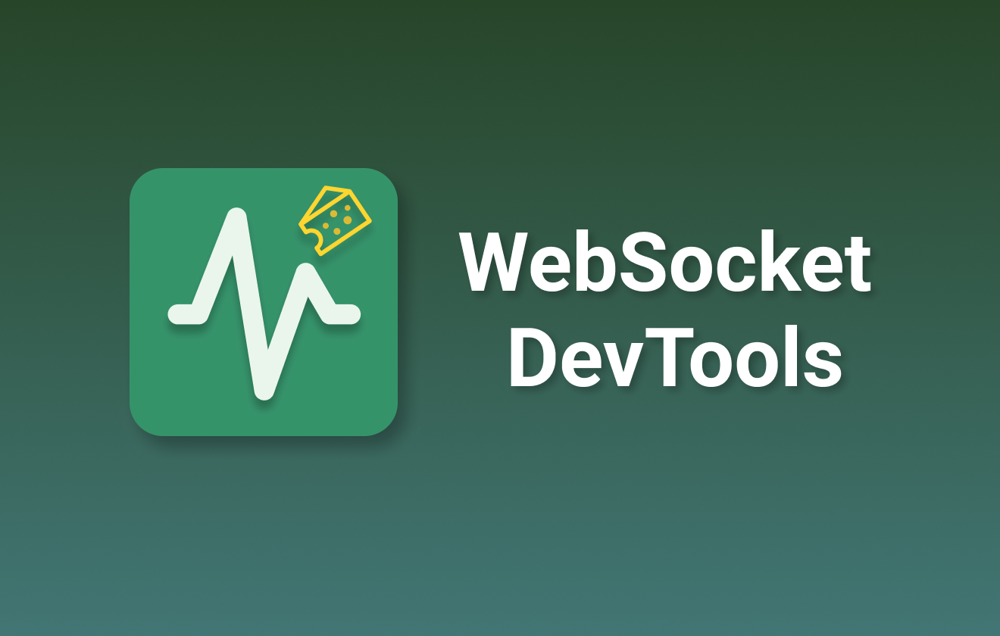

# WebSocket DevTools

**Professional WebSocket debugging tool for Chrome DevTools**

## 🔍 Real-time WebSocket Monitoring

Monitor all WebSocket connections with live status tracking and message flow visualization. View incoming and outgoing messages as they happen with precise timestamps.

## 📋 Message Details & JSON Viewer

Click any connection to inspect message history with beautiful syntax highlighting. JSON messages are automatically formatted for easy reading and debugging.

## 🎮 Message Simulation & Traffic Control

Send custom messages in both directions with our advanced editor. Block specific messages to test error scenarios and edge cases.

## 💾 Smart Favorites System

Save frequently used messages for quick access. Organize your message library and export/import collections for team collaboration.

## ✨ Key Features

- **🔍 Real-time Monitoring** - Track WebSocket connections and messages with live updates
- **🎮 Message Simulation** - Send custom messages in both directions (Client ↔ Server)  
- **🚧 Traffic Control** - Block messages and simulate network issues for testing
- **💾 Favorites System** - Save and organize frequently used messages
- **🌍 Multi-language** - Full English and Chinese support
- **🎨 DevTools Integration** - Native Chrome DevTools panel experience

## 🚀 Installation

### Chrome Web Store
1. Visit [Chrome Web Store](https://chrome.google.com/webstore/detail/websocket-devtools/your-extension-id)
2. Click **"Add to Chrome"** and confirm installation
3. Open DevTools (F12) → **"WebSocket DevTools"** tab

### Manual Installation  
1. Download from [GitHub Releases](https://github.com/law-chain-hot/websocket-devtools/releases)
2. Open `chrome://extensions/` → Enable **Developer mode**
3. Click **"Load unpacked"** and select the folder

## 📖 Quick Start

1. **Open DevTools** (F12) → Find **"WebSocket DevTools"** tab
2. **Start Monitoring** - Automatically detects WebSocket connections
3. **Inspect Messages** - Click connections to view message history  
4. **Simulate Messages** - Use Simulate tab with JSON editor
5. **Save Favorites** - Star frequently used messages for quick access

## 🔒 Privacy & Security

- ✅ **No data collection** - Everything stays in your browser
- ✅ **Local storage only** - No external servers or tracking
- ✅ **Open source** - Fully transparent and auditable code
- ✅ **Minimal permissions** - Only what's needed for functionality

## 🛠 Requirements

- **Chrome 88+** or Chromium-based browsers (Edge, Brave, etc.)
- **WebSocket API** - Compatible with all WebSocket implementations
- Works with **Socket.IO**, **ws library**, and custom WebSocket solutions

---

**MIT License** • [⭐ GitHub](https://github.com/law-chain-hot/websocket-devtools) • [📖 Wiki](https://github.com/law-chain-hot/websocket-devtools/wiki)

 