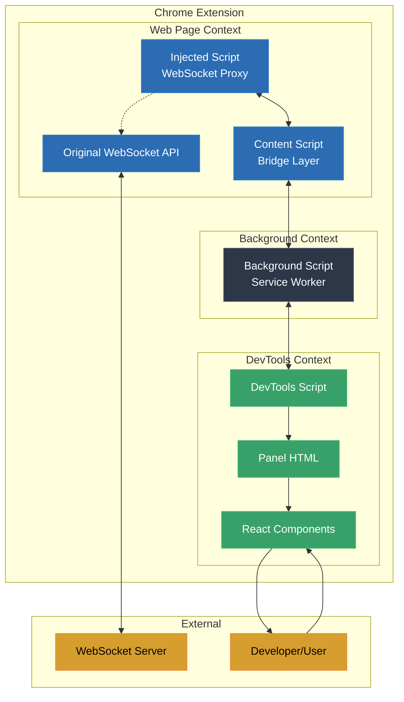
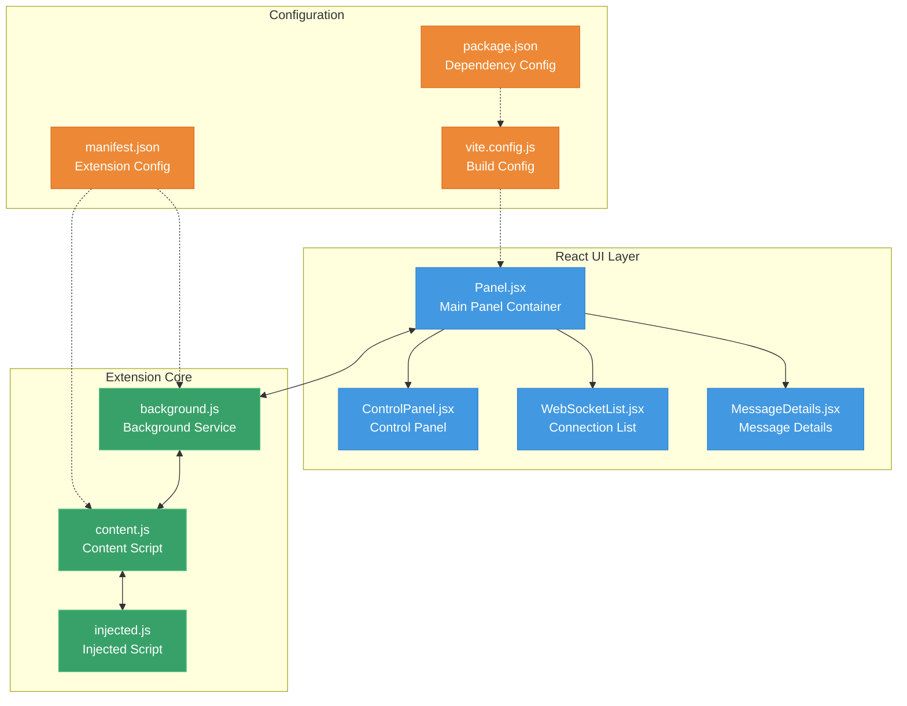
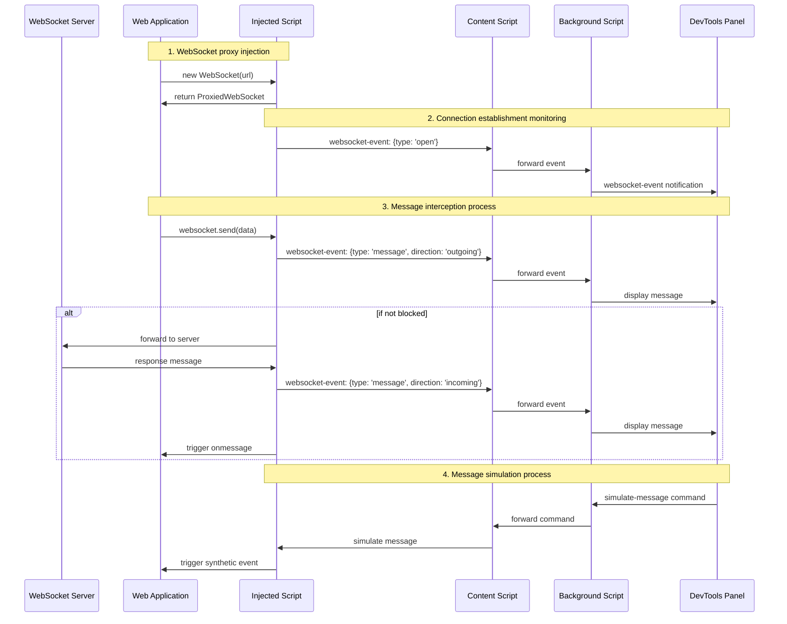
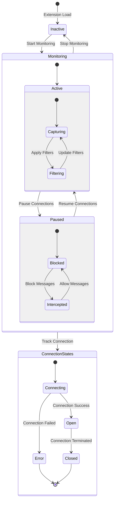
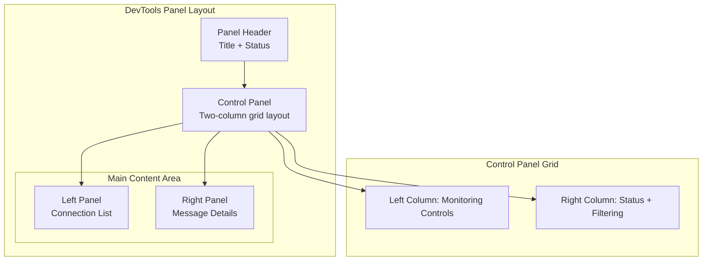
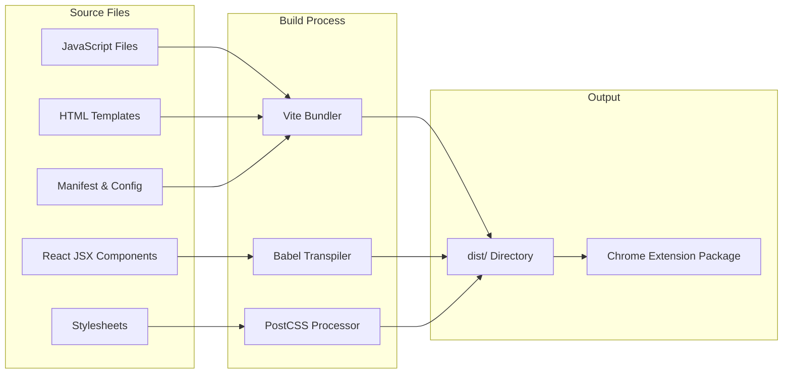

# WebSocket Proxy Chrome Extension

## 📋 Project Overview

WebSocket Proxy Chrome Extension is a powerful Chrome DevTools extension designed for monitoring, intercepting, modifying, and simulating WebSocket connections. The extension uses Chrome Extension V3 architecture and React frontend framework, providing a modern UI and complete WebSocket debugging capabilities.

### 🎯 Core Goals

- **Real-time Monitoring**: Capture and display all WebSocket connections and messages
- **Smart Interception**: Pause, block, or modify WebSocket communications
- **Message Simulation**: Simulate sending and receiving WebSocket messages
- **Debugging Assistance**: Provide comprehensive debugging tools for WebSocket application development

## ✨ Features

### 🔍 Monitoring Features

- [x] Real-time WebSocket connection detection
- [x] Real-time message content capture
- [x] Connection state tracking (connecting, open, closed, error)
- [x] Timestamp recording and formatted display
- [x] Automatic JSON message formatting

### 🎛️ Control Features

- [x] Start/Stop monitoring
- [x] Pause/Resume all connections
- [x] Selectively block outbound/inbound messages
- [x] Clear connection history

### 🔧 Interaction Features

- [x] Expand/collapse message display
- [x] Message content search and filter
- [x] Filter messages by direction (outgoing/incoming)
- [x] Group connections display (active/inactive)

### 🎭 Simulation Features

- [x] Simulate sending messages (outgoing simulation)
- [x] Simulate receiving messages (incoming simulation)
- [x] Support arbitrary JSON/text content
- [x] Special marker for simulated messages

### 🎨 UI Features

- [x] Modern dark theme
- [x] Responsive layout design
- [x] Compact two-column control panel
- [x] Intuitive status indicators

## 🏗️ System Architecture

### Overall Architecture Diagram



### Component Relationship Diagram



## 🔄 Data Flow Design

### WebSocket Message Flow Diagram



### State Management Flow Diagram



## 🔧 Technical Implementation

### Core Tech Stack

| Technology            | Version | Purpose         |
| ---------------------| ------- | -------------- |
| Chrome Extension API | V3      | Extension Core |
| React                | ^18.0   | UI Framework   |
| Vite                 | ^7.0    | Build Tool     |
| JavaScript           | ES2022  | Programming    |
| CSS3                 | -       | Styling        |

### WebSocket Proxy Implementation

```javascript
// injected.js core proxy logic
const OriginalWebSocket = window.WebSocket;

function ProxiedWebSocket(url, protocols) {
    const ws = new OriginalWebSocket(url, protocols);
    const connectionId = generateConnectionId();

    // Intercept send method
    const originalSend = ws.send;
    ws.send = function(data) {
        // Intercept before sending
        sendMessageToContentScript({
            type: 'websocket-event',
            data: {
                id: connectionId,
                type: 'message',
                direction: 'outgoing',
                data: data,
                timestamp: Date.now()
            }
        });

        // Decide whether to actually send based on state
        if (!proxyState.isPaused && !proxyState.blockOutgoing) {
            return originalSend.call(this, data);
        }
    };

    // Intercept message reception
    ws.addEventListener('message', function(event) {
        sendMessageToContentScript({
            type: 'websocket-event',
            data: {
                id: connectionId,
                type: 'message',
                direction: 'incoming',
                data: event.data,
                timestamp: Date.now()
            }
        });
    });

    return ws;
}

// Replace native WebSocket
Object.defineProperty(window, 'WebSocket', {
    value: ProxiedWebSocket,
    writable: false,
    configurable: false
});
```

### Message Routing Mechanism

```javascript
// background.js message routing
chrome.runtime.onMessage.addListener((message, sender, sendResponse) => {
    switch (message.type) {
        case 'websocket-event':
            // Forward to DevTools panel
            forwardToDevToolsPanel(message);
            break;

        case 'start-monitoring':
            // Activate monitoring
            activateMonitoring(sender.tab.id);
            break;

        case 'pause-connections':
            // Pause connections
            pauseWebSocketConnections(sender.tab.id);
            break;

        case 'simulate-message':
            // Simulate message
            simulateWebSocketMessage(sender.tab.id, message.data);
            break;
    }
});
```

## 📁 Project Structure

```
sonet4/
├── src/
│   ├── background/
│   │   └── background.js          # Background service script
│   ├── content/
│   │   ├── content.js             # Content script bridge layer
│   │   └── injected.js            # WebSocket proxy injection
│   ├── devtools/
│   │   ├── devtools.html          # DevTools entry page
│   │   ├── devtools.js            # DevTools registration script
│   │   ├── panel.html             # Panel HTML template
│   │   └── panel.jsx              # React main panel component
│   ├── components/
│   │   ├── ControlPanel.jsx       # Control panel component
│   │   ├── WebSocketList.jsx      # Connection list component
│   │   └── MessageDetails.jsx     # Message details component
│   ├── styles/
│   │   └── panel.css              # Global style file
│   ├── utils/                     # Utility functions directory
│   └── manifest.json              # Extension config file
├── public/                        # Static resources directory
├── dist/                          # Build output directory
├── test-websocket.html            # WebSocket test page
├── verify-proxy.html              # Proxy verification page
├── package.json                   # Project dependency config
├── pnpm-lock.yaml                # Locked dependency versions
├── vite.config.js                # Vite build config
└── README.md                      # Project documentation
```

## 🎨 UI/UX Design

### Design Principles

1. **Simplicity & Efficiency**: Minimize interface complexity, highlight core features
2. **Information Hierarchy**: Reasonable information architecture and visual hierarchy
3. **Status Feedback**: Clear status indicators and operation feedback
4. **Responsiveness**: Adapt to different DevTools window sizes

### Color System

```css
:root {
  /* Theme colors */
  --bg-primary: #1a202c;      /* Main background */
  --bg-secondary: #2d3748;    /* Secondary background */
  --bg-tertiary: #4a5568;     /* Tertiary background */

  /* Text colors */
  --text-primary: #f7fafc;    /* Primary text */
  --text-secondary: #e2e8f0;  /* Secondary text */
  --text-muted: #a0aec0;      /* Muted text */

  /* Functional colors */
  --accent-color: #3182ce;    /* Accent color */
  --success-color: #38a169;   /* Success state */
  --warning-color: #d69e2e;   /* Warning state */
  --danger-color: #e53e3e;    /* Danger state */

  /* Border and spacing */
  --border-color: #4a5568;    /* Border color */
  --radius: 6px;              /* Border radius */
}
```

### Layout Architecture



## 🔨 Build & Deployment

### Build Process



### Build Commands

```bash
# Development build
npm run dev

# Production build
npm run build

# Clean build
rm -rf dist && npm run build

# Install dependencies
pnpm install
```

### Deployment Steps

1. **Build the extension**

   ```bash
   npm run build
   ```

2. **Load into Chrome**

   - Open `chrome://extensions/`
   - Enable "Developer mode"
   - Click "Load unpacked extension"
   - Select the `dist` directory

3. **Use the extension**
   - Open a webpage with WebSocket
   - Press F12 to open DevTools
   - Switch to the "WebSocket Monitor" panel

## 🚀 Extension Guide

### Steps to Add New Features

#### 1. Add UI Component

```javascript
// src/components/NewFeature.jsx
import React from 'react';

const NewFeature = ({ data, onAction }) => {
  return (
    <div className="new-feature">
      {/* Component content */}
    </div>
  );
};

export default NewFeature;
```

#### 2. Add Message Type

```javascript
// Add new message handler in background.js
case 'new-feature-action':
  handleNewFeatureAction(message.data);
  break;
```

#### 3. Extend Style System

```css
/* Add new styles in panel.css */
.new-feature {
  /* New feature styles */
}
```

### Common Extension Scenarios

#### Scenario 1: Add Message Filter Rule

```javascript
// Extend filter logic in MessageDetails.jsx
const filteredMessages = connection.messages
  .filter((msg) => {
    // Existing filter logic
    if (filterDirection !== "all" && msg.direction !== filterDirection) return false;
    if (filterText.trim() && !msg.data.toLowerCase().includes(filterText.toLowerCase())) return false;

    // New: Filter by message size
    if (filterBySize && msg.data.length > maxMessageSize) return false;

    return true;
  });
```

#### Scenario 2: Add New WebSocket Event Listener

```javascript
// Add new event in injected.js
ws.addEventListener('error', function(event) {
  sendMessageToContentScript({
    type: 'websocket-event',
    data: {
      id: connectionId,
      type: 'error',
      error: event.error,
      timestamp: Date.now()
    }
  });
});
```

#### Scenario 3: Extend Storage Functionality

```javascript
// Use Chrome storage API to save config
chrome.storage.local.set({
  'websocket-proxy-settings': {
    autoStart: true,
    defaultFilters: ['json', 'text'],
    maxStoredMessages: 1000
  }
});
```

### Performance Optimization Suggestions

1. **Message Limit**: Limit the number of stored historical messages
2. **Virtual Scrolling**: Use virtual scrolling for large numbers of messages
3. **Debounced Search**: Use debounce for search input
4. **Lazy Loading**: Lazy load large message content

### API Reference

#### Chrome Extension API Usage

- `chrome.runtime.*` - Message passing and lifecycle
- `chrome.devtools.*` - DevTools integration
- `chrome.tabs.*` - Tab operations
- `chrome.storage.*` - Data storage

#### Custom Event Types

- `websocket-event` - WebSocket related events
- `start-monitoring` - Start monitoring command
- `stop-monitoring` - Stop monitoring command
- `pause-connections` - Pause connections command
- `simulate-message` - Simulate message command

## 🐛 Troubleshooting

### Common Issues

#### 1. Extension Fails to Load

- Check `manifest.json` syntax
- Ensure all file paths are correct
- Check error messages on the Chrome extensions page

#### 2. WebSocket Proxy Not Working

- Ensure `injected.js` is successfully injected
- Check Content Security Policy restrictions
- Verify WebSocket API is correctly replaced

#### 3. Messages Not Displayed

- Check message routing chain
- Ensure DevTools panel is open
- Check console error messages

### Debugging Tips

1. **Console Logging**: Use emoji to mark logs from different modules

   ```javascript
   console.log('🔧 injected:', data);
   console.log('🌉 content:', data);
   console.log('🎯 background:', data);
   console.log('📊 panel:', data);
   ```

2. **Debug Object**: Expose debug interface in injected script
   ```javascript
   window.websocketProxyDebug = {
     getConnections: () => connections,
     getProxyState: () => proxyState,
     testSimulation: (data) => simulateMessage(data)
   };
   ```

## 📈 Version History

### v1.0.0 (Current)

- ✅ Basic WebSocket monitoring functionality
- ✅ Message interception and simulation
- ✅ Modern UI interface
- ✅ Two-column control panel layout
- ✅ Message search and filtering

### Future Roadmap

#### v1.1.0 (Planned)

- [ ] WebSocket connection statistics chart
- [ ] Message export function (JSON/CSV)
- [ ] Custom filter rule editor
- [ ] Message template management

#### v1.2.0 (Planned)

- [ ] WebSocket protocol analysis
- [ ] Performance monitoring metrics
- [ ] Batch message operations
- [ ] Plugin system architecture

## 🤝 Contribution Guide

### Development Environment Setup

1. Clone the repository
2. Install dependencies: `pnpm install`
3. Development build: `npm run dev`
4. Test feature completeness

### Code Standards

- Use ESLint and Prettier for code formatting
- Follow React Hooks best practices
- Add appropriate comments and type annotations
- Ensure backward compatibility

### Commit Conventions

```
feat: add new feature
fix: fix bug
docs: update documentation
style: code style adjustment
refactor: code refactoring
test: add tests
chore: build/toolchain related
```

---

**📝 Documentation Maintenance**: This document should be continuously updated with feature iterations to ensure it stays in sync with the actual code implementation.

**🔗 Related Links**:

- [Chrome Extension Development Guide](https://developer.chrome.com/docs/extensions/)
- [WebSocket API Documentation](https://developer.mozilla.org/en-US/docs/Web/API/WebSocket)
- [React Official Documentation](https://react.dev/)
- [Vite Build Tool](https://vitejs.dev/)
