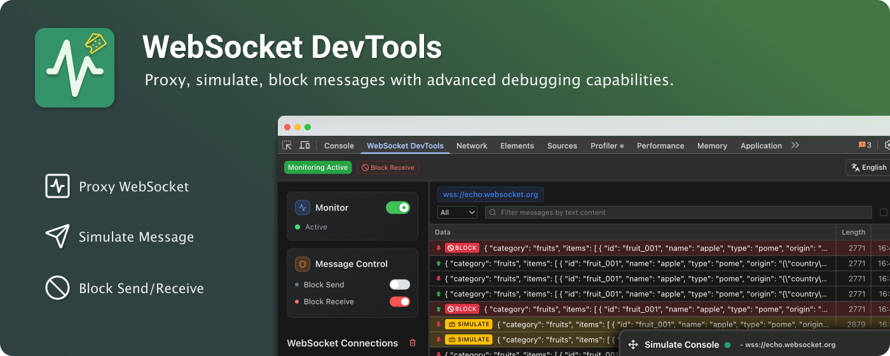
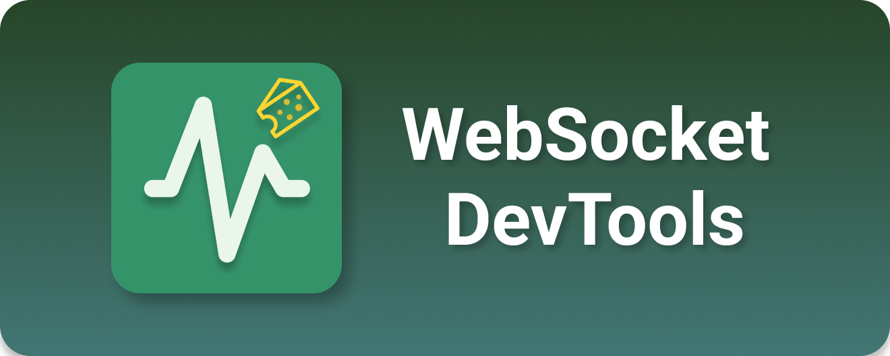
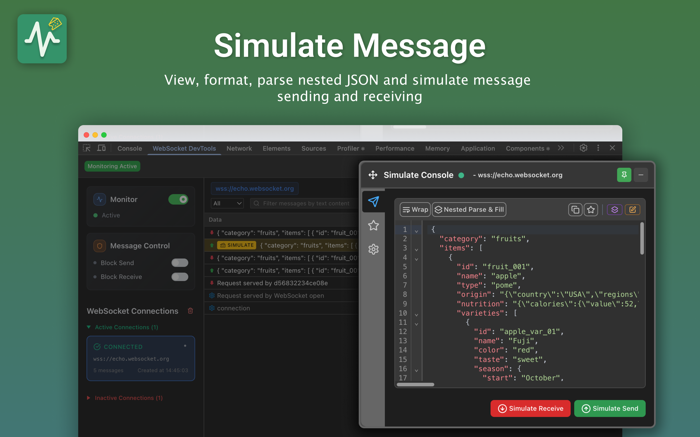
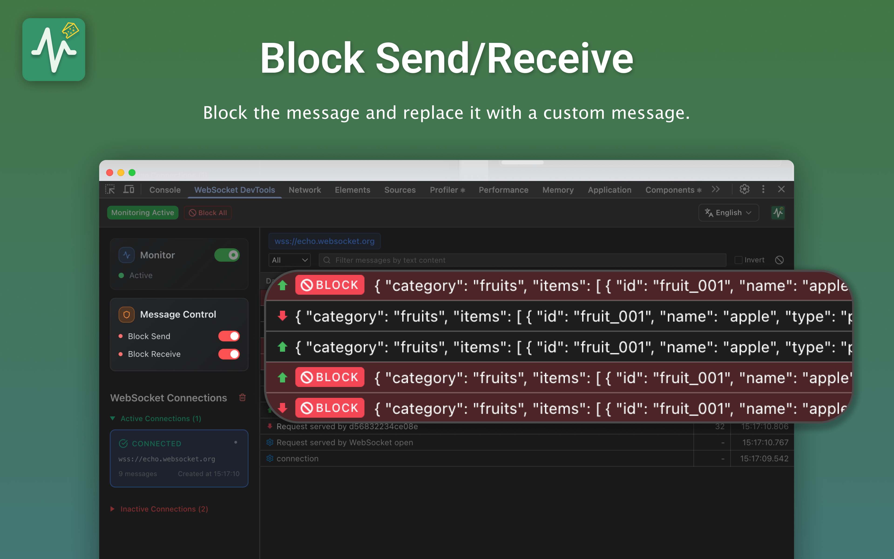
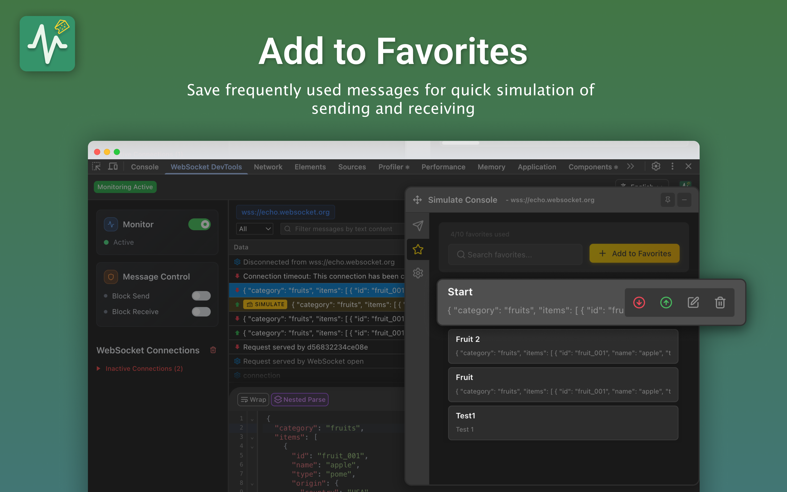
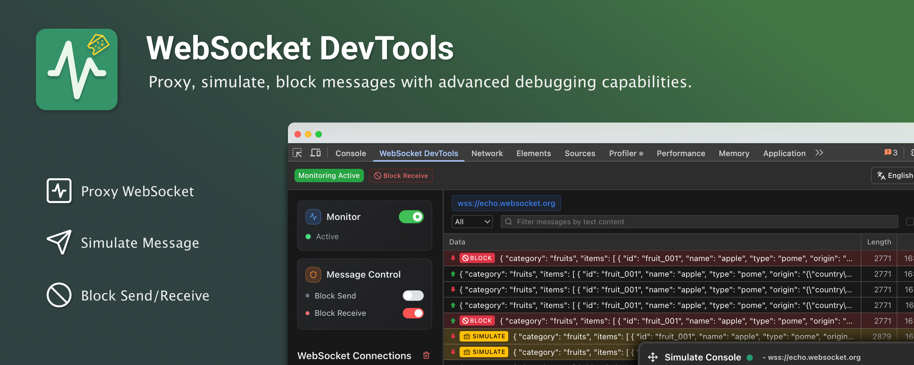

<!--  -->

## WebSocket DevTools

Professional debugging tool with real-time monitoring, message simulation,  
and traffic interception for developers

[![][version-shield]][version-link]
[![][license-shield]][license-link]
[![][privacy-shield]][privacy-link]
[![][homepage-shield]][homepage-link]
[![][chrome-shield]][chrome-link]
[![][stars-shield]][stars-link]
[![][deepwiki-shield]][deepwiki-link]
[![][youtube-shield]][youtube-link]

**English** | [简体中文](./README_zh-CN.md)

## 🚀 Installation

### Chrome Web Store
1. Visit [Chrome Web Store](https://chromewebstore.google.com/detail/websocket-devtools/fmnaobbfmjaaaebelkacpmmmpaaefbod)
2. Click **"Add to Chrome"** and confirm installation
3. Open DevTools (F12) → **"WebSocket DevTools"** tab

### Homepage

- 🌐 [WebSocket DevTools](https://websocket-devtools.com) - Official website with documentation and demos 
- 📺 [YouTube Video](https://www.youtube.com/watch?v=L64x__1xORQ) - Demo video

## ✨ Key Features

- **🔍 Real-time Monitoring** - Track WebSocket connections and messages with live updates
- **🔄 Background Monitoring** - Continuously monitor connections even when DevTools panel is closed
- **🎮 Message Simulation** - Send custom messages in both directions (Client ↔ Server)  
- **🚧 Traffic Control** - Block messages and simulate network issues for testing
- **💾 Favorites System** - Save and organize frequently used messages
- **🌍 Multi-language** - Full English and Chinese support
- **🎨 DevTools Integration** - Native Chrome DevTools panel experience
- **🖼️ Iframe Support** - Full WebSocket proxy support for iframe embedded connections

## 🎬 Quick Demo

### Blocking

### Simulation

**Key Features Demonstrated:**
- **Message Blocking**: Intercept and block WebSocket messages in real-time
- **Message Simulation**: Send custom messages to test different scenarios
- **Traffic Control**: Manage WebSocket traffic flow for debugging
- **JSON Support**: Full JSON parsing and formatting capabilities

## 📷 Screenshots

### Message Details & JSON Viewer

### Message Simulation & Traffic Control

### Smart Favorites System

## 📖 Quick Start

1. **Install Extension** - Add to Chrome and enable background monitoring
2. **Open DevTools** (F12) → Find **"WebSocket DevTools"** tab
3. **View Captured Data** - All WebSocket connections are automatically captured in background
4. **Inspect Messages** - Click connections to view message history  
5. **Simulate Messages** - Use Simulate tab with JSON editor
6. **Save Favorites** - Star frequently used messages for quick access

> **💡 Pro Tip**: The extension monitors WebSocket connections in the background, so you won't miss any connections even if you open DevTools after the WebSocket is established!

## 🔒 Privacy & Security

- ✅ **No data collection** - Everything stays in your browser
- ✅ **Local storage only** - No external servers or tracking
- ✅ **Open source** - Fully transparent and auditable code
- ✅ **Minimal permissions** - Only what's needed for functionality

## 🛠 Requirements

- **Chrome 88+** or Chromium-based browsers (Edge, Brave, etc.)
- **WebSocket API** - Compatible with all WebSocket implementations
- Works with **Socket.IO**, **ws library**, and custom WebSocket solutions

---

---

**MIT License** • [⭐ GitHub](https://github.com/law-chain-hot/websocket-devtools) • [📖 Wiki](https://github.com/law-chain-hot/websocket-devtools/wiki) • [📚 DeepWiki](https://deepwiki.com/law-chain-hot/websocket-devtools) • [🛒 Chrome Store](https://chromewebstore.google.com/detail/websocket-devtools/fmnaobbfmjaaaebelkacpmmmpaaefbod) • [📺 YouTube](https://www.youtube.com/watch?v=L64x__1xORQ)

 

[version-shield]: https://img.shields.io/badge/version-1.0.3-55b467?labelColor=black&logo=github&style=flat-square
[license-shield]: https://img.shields.io/badge/license-MIT-369eff?labelColor=black&logo=opensourceinitiative&style=flat-square
[chrome-shield]: https://img.shields.io/badge/Chrome%20Web%20Store-Install-ffcb47?labelColor=black&logo=googlechrome&logoColor=white&style=flat-square
[privacy-shield]: https://img.shields.io/badge/privacy-local%20only-c4f042?labelColor=black&logo=shield-check&style=flat-square
[homepage-shield]: https://img.shields.io/badge/Homepage-WebSocket%20DevTools-blue?labelColor=black&logo=globe&style=flat-square
[websocket-shield]: https://img.shields.io/badge/WebSocket-DevTools-ff80eb?labelColor=black&logo=websocket&style=flat-square
[devtools-shield]: https://img.shields.io/badge/DevTools-Panel-8ae8ff?labelColor=black&logo=googlechrome&style=flat-square
[deepwiki-shield]: https://img.shields.io/badge/DeepWiki-Docs-orange?labelColor=black&logo=book&style=flat-square
[stars-shield]: https://img.shields.io/github/stars/law-chain-hot/websocket-devtools?color=ffcb47&labelColor=black&style=flat-square 
[version-link]: https://github.com/law-chain-hot/websocket-devtools/releases
[license-link]: ./LICENSE
[chrome-link]: https://chromewebstore.google.com/detail/websocket-devtools/fmnaobbfmjaaaebelkacpmmmpaaefbod
[privacy-link]: ./PRIVACY.md
[homepage-link]: https://websocket-devtools.com
[websocket-link]: https://github.com/law-chain-hot/websocket-devtools
[devtools-link]: https://chromewebstore.google.com/detail/websocket-devtools/fmnaobbfmjaaaebelkacpmmmpaaefbod
[deepwiki-link]: https://deepwiki.com/law-chain-hot/websocket-devtools
[stars-link]: https://github.com/law-chain-hot/websocket-devtools/stargazers
[youtube-shield]: https://img.shields.io/badge/YouTube-Video-red?labelColor=black&logo=youtube&style=flat-square
[youtube-link]: https://www.youtube.com/watch?v=L64x__1xORQ
