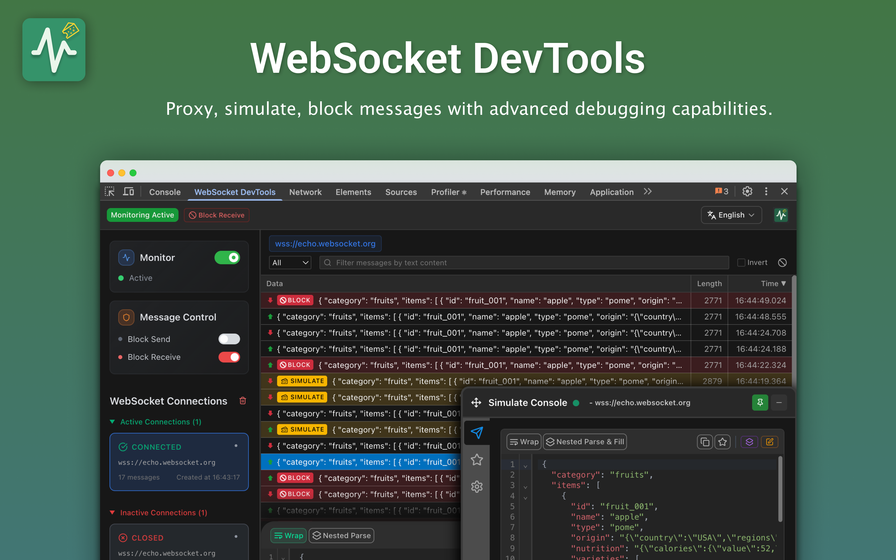

<!--  -->

## WebSocket DevTools

Professional debugging tool with real-time monitoring, message simulation,  
and traffic interception for developers with advanced UI

<!-- **English** | [简体中文](./README_zh-CN.md) -->

## 🚀 Installation

### Chrome Web Store
1. Visit [Chrome Web Store](https://chromewebstore.google.com/detail/websocket-devtools/fmnaobbfmjaaaebelkacpmmmpaaefbod)
2. Click **"Add to Chrome"** and confirm installation
3. Open DevTools (F12) → **"WebSocket DevTools"** tab

## ✨ Key Features

- **🔍 Real-time Monitoring** - Track WebSocket connections and messages with live updates
- **🔄 Background Monitoring** - Continuously monitor WebSocket connections even when DevTools panel is closed
- **🎮 Message Simulation** - Send custom messages in both directions (Client ↔ Server)  
- **🚧 Traffic Control** - Block messages and simulate network issues for testing
- **💾 Favorites System** - Save and organize frequently used messages
- **🌍 Multi-language** - Full English and Chinese support
- **🎨 DevTools Integration** - Native Chrome DevTools panel experience
- **🖼️ Iframe Support** - Full WebSocket proxy support for iframe embedded connections

## 📷 Screenshots

### Message Details & JSON Viewer

### Message Simulation & Traffic Control

### Smart Favorites System

## 📖 Quick Start

1. **Install Extension** - Add to Chrome and enable background monitoring
2. **Open DevTools** (F12) → Find **"WebSocket DevTools"** tab
3. **View Captured Data** - All WebSocket connections are automatically captured in background
4. **Inspect Messages** - Click connections to view message history  
5. **Simulate Messages** - Use Simulate tab with JSON editor
6. **Save Favorites** - Star frequently used messages for quick access

> **💡 Pro Tip**: The extension monitors WebSocket connections in the background, so you won't miss any connections even if you open DevTools after the WebSocket is established!

## 🔒 Privacy & Security

- ✅ **No data collection** - Everything stays in your browser
- ✅ **Local storage only** - No external servers or tracking
- ✅ **Open source** - Fully transparent and auditable code
- ✅ **Minimal permissions** - Only what's needed for functionality

## 🛠 Requirements

- **Chrome 88+** or Chromium-based browsers (Edge, Brave, etc.)
- **WebSocket API** - Compatible with all WebSocket implementations
- Works with **Socket.IO**, **ws library**, and custom WebSocket solutions

---

---

**MIT License** • [⭐ GitHub](https://github.com/law-chain-hot/websocket-devtools) • [📖 Wiki](https://github.com/law-chain-hot/websocket-devtools/wiki) • [📚 DeepWiki](https://deepwiki.com/law-chain-hot/websocket-devtools) • [🛒 Chrome Store](https://chromewebstore.google.com/detail/websocket-devtools/fmnaobbfmjaaaebelkacpmmmpaaefbod)

 
