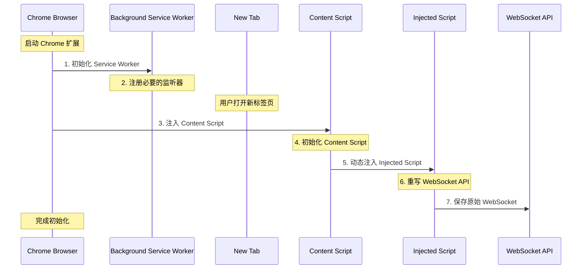
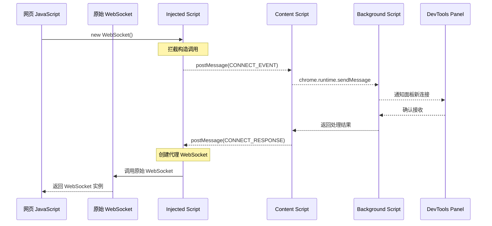
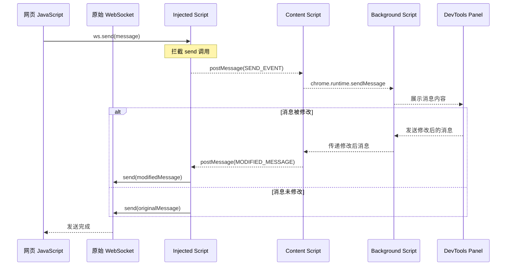
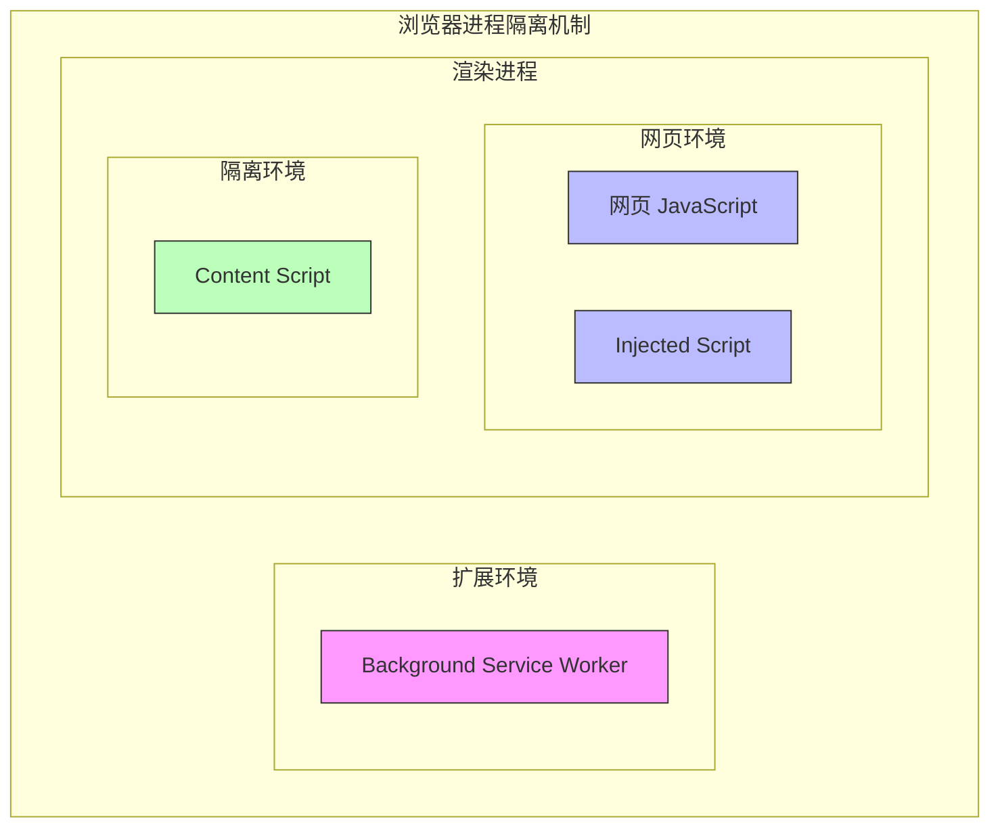
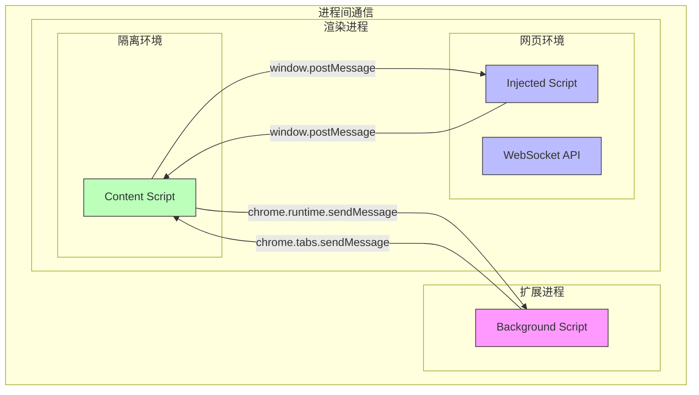
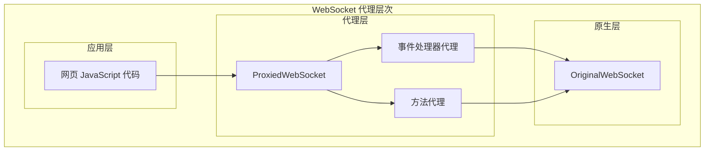
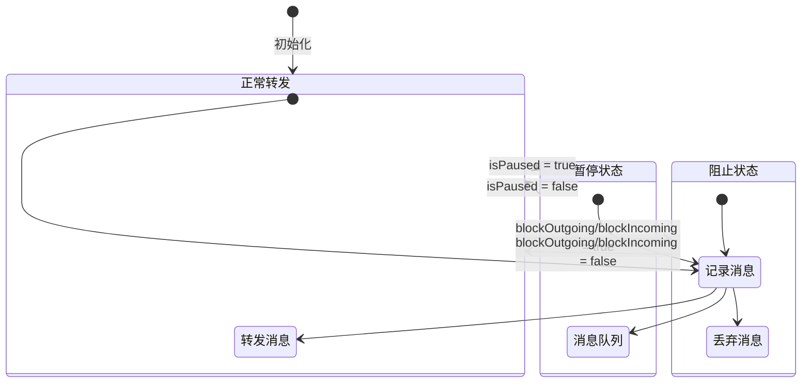

# WebSocket Proxy 架构说明

## 1. 初始化加载顺序



### 1.1 初始化流程详解

1. **Background Service Worker 初始化**

   - 扩展安装或浏览器启动时首先加载
   - 注册全局事件监听器
   - 初始化存储和状态管理

2. **Content Script 注入时机**

   - 在页面的 document_start 阶段注入
   - 这个时机在 DOM 构建之前
   - 确保能够捕获所有 WebSocket 操作

3. **Injected Script 注入过程**
   - Content Script 通过创建 `<script>` 标签注入
   - 在页面的 JavaScript 环境中执行
   - 在 window 对象初始化完成后执行

## 2. 典型操作时序

### 2.1 WebSocket 连接建立的完整时序



### 2.2 消息发送的完整时序



## 3. 浏览器安全机制与通信原理

### 3.1 不同执行环境的隔离机制



### 3.2 为什么需要 postMessage？

浏览器实现了严格的安全隔离机制，这些机制决定了不同脚本之间的通信方式：

1. **同源策略 (Same-Origin Policy)**

   - 不同源的页面间不能直接访问数据
   - Content Script 和网页属于不同源
   - 需要通过消息传递机制通信

2. **环境隔离**

   - Content Script 运行在隔离环境中
   - Injected Script 运行在网页环境中
   - Background Script 运行在扩展环境中
   - 每个环境都有自己的 JavaScript 上下文

3. **权限隔离**
   ```
   Background Script (完整扩展权限)
          ↕
   Content Script (受限扩展权限 + DOM 访问)
          ↕
   Injected Script (网页环境权限)
   ```

### 3.3 通信机制详解

1. **Content Script 与 Injected Script 通信**

   - 使用 window.postMessage
   - 原因：运行在同一渲染进程但不同的 JavaScript 上下文
   - 示例：

   ```javascript
   // Content Script 发送消息
   window.postMessage({
       source: 'websocket-proxy',
       type: 'command',
       data: {...}
   }, '*');

   // Injected Script 接收消息
   window.addEventListener('message', (event) => {
       // 验证消息来源
       if (event.source !== window) return;
       if (event.data.source !== 'websocket-proxy') return;
       // 处理消息
   });
   ```

2. **Background Script 与 Content Script 通信**

   - 使用 chrome.runtime.sendMessage 和 chrome.tabs.sendMessage
   - 原因：运行在不同的进程
   - 示例：

   ```javascript
   // Background Script 发送消息
   chrome.tabs.sendMessage(tabId, {
       type: 'command',
       data: {...}
   });

   // Content Script 接收消息
   chrome.runtime.onMessage.addListener((message, sender, sendResponse) => {
       // 处理消息
       sendResponse({ success: true });
   });
   ```

### 3.4 安全性考虑

1. **消息验证**

   ```javascript
   // 消息格式
   interface Message {
       source: string;        // 消息来源标识
       type: string;         // 消息类型
       timestamp: number;    // 时间戳
       nonce: string;       // 随机数
       data: any;          // 消息数据
       signature?: string; // 可选的消息签名
   }
   ```

2. **数据隔离**

   - 每个标签页的数据独立存储
   - WebSocket 连接状态独立管理
   - 不同标签页的消息不互相影响

3. **错误处理**
   ```javascript
   try {
       // 发送消息
       window.postMessage(message, '*');
   } catch (error) {
       // 错误恢复机制
       handleCommunicationError(error);
   }
   ```

## 4. 性能优化

### 4.1 消息批处理

```javascript
// 消息队列
const messageQueue = [];
const BATCH_SIZE = 10;
const FLUSH_INTERVAL = 100;

// 批量发送
setInterval(() => {
    if (messageQueue.length >= BATCH_SIZE) {
        sendMessageBatch(messageQueue.splice(0, BATCH_SIZE));
    }
}, FLUSH_INTERVAL);
```

### 4.2 内存管理

```javascript
// 限制历史消息数量
const MAX_HISTORY = 1000;
const messageHistory = new LimitedArray(MAX_HISTORY);

// 大消息分片处理
const CHUNK_SIZE = 1024 * 1024; // 1MB
function* messageChunker(message) {
    for (let i = 0; i < message.length; i += CHUNK_SIZE) {
        yield message.slice(i, i + CHUNK_SIZE);
    }
}
```

## 5. 调试技巧

### 5.1 注入脚本调试

```javascript
// 在 Injected Script 中添加调试点
const originalWebSocket = window.WebSocket;
window.WebSocket = function(...args) {
    console.debug('WebSocket Constructor Called:', ...args);
    debugger; // 调试断点
    return new originalWebSocket(...args);
};
```

### 5.2 消息追踪

```javascript
// 在 Content Script 中添加消息追踪
function traceMessage(message) {
    console.group('Message Trace');
    console.log('Timestamp:', Date.now());
    console.log('Message:', message);
    console.trace('Stack Trace');
    console.groupEnd();
}
```

## 6. 通信机制与代理能力

### 6.1 通信机制的可视化



### 6.2 通信机制的类比

想象一个大型办公楼的安全通信系统：

1. **同一层楼的不同房间** (Content Script 与 Injected Script)

   - 使用 window.postMessage，就像通过内部对讲系统通信
   - 虽然在同一层，但有安全门隔开（不同的 JavaScript 上下文）
   - 通信快速，但需要身份验证

2. **不同楼层之间** (Background Script 与 Content Script)
   - 使用 chrome.runtime.sendMessage，像是通过大楼的中央通信系统
   - 需要通过前台登记和验证（Chrome 扩展的权限系统）
   - 通信有一定延迟，但更安全可靠

### 6.3 WebSocket 代理能力

这个扩展的代理能力确实类似于"中间人"模式，但是是一个"善意的中间人"。就像一个可信的邮件分拣中心：

1. **消息拦截能力**

   ```javascript
   // 拦截 WebSocket 构造函数
   window.WebSocket = function ProxiedWebSocket(url, protocols) {
       const ws = new OriginalWebSocket(url, protocols);
       // 添加监控和控制逻辑
       return ws;
   }
   ```

2. **消息修改能力**

   - 可以修改、延迟或阻止消息
   - 可以注入新消息
   - 可以模拟连接状态

3. **控制流程**

   ```mermaid
   sequenceDiagram
       participant Client as 客户端
       participant Proxy as WebSocket代理
       participant Server as 服务器

       Client->>Proxy: 发送消息
       Note over Proxy: 1. 记录消息
       Note over Proxy: 2. 可以修改消息
       Note over Proxy: 3. 可以阻止消息
       Proxy->>Server: 转发消息
       Server-->>Proxy: 返回响应
       Note over Proxy: 同样的处理流程
       Proxy-->>Client: 转发响应
   ```

### 6.4 代理能力的类比

想象一个国际邮件处理中心：

1. **邮件分拣** (消息拦截)

   - 可以看到所有进出的邮件
   - 确保邮件符合规定
   - 可以暂时保留可疑邮件

2. **邮件处理** (消息修改)

   - 可以翻译邮件内容
   - 可以添加额外信息
   - 可以根据规则过滤内容

3. **邮件路由** (消息控制)
   - 决定邮件的发送时机
   - 可以更改邮件的优先级
   - 可以将邮件重定向到不同目的地

### 6.5 安全考虑

与传统的"中间人攻击"不同，这个代理系统：

1. **透明性**

   - 用户知道代理的存在
   - 所有操作可以在 DevTools 中监控
   - 提供清晰的状态指示

2. **可控性**

   - 用户可以随时启用/禁用代理
   - 可以选择性地处理特定消息
   - 提供消息修改的审计日志

3. **安全性**
   - 只在用户授权的页面中运行
   - 不会泄露敏感信息
   - 不会破坏 WebSocket 的安全特性

## 7. WebSocket 代理实现详解

### 7.1 代理架构概览



### 7.2 拦截的功能清单

1. **构造函数拦截**

   ```javascript
   // 保存原始构造函数
   const OriginalWebSocket = window.WebSocket;

   // 定义代理构造函数
   function ProxiedWebSocket(url, protocols) {
       const ws = new OriginalWebSocket(url, protocols);
       const connectionId = generateConnectionId();
       // ... 代理逻辑
       return ws;
   }

   // 替换全局构造函数
   Object.defineProperty(window, 'WebSocket', {
       value: ProxiedWebSocket,
       writable: false,
       configurable: false
   });
   ```

2. **方法拦截**

   ```mermaid
   graph LR
       subgraph "方法代理"
           SEND[send]
           CLOSE[close]
       end

       SEND --> |"拦截"| ORIG_SEND[原始 send]
       CLOSE --> |"拦截"| ORIG_CLOSE[原始 close]
   ```

   - send 方法

   ```javascript
   const originalSend = ws.send.bind(ws);
   ws.send = function(data) {
       // 1. 消息记录
       // 2. 状态检查
       // 3. 消息修改
       // 4. 条件转发
       return originalSend(data);
   };
   ```

   - close 方法

   ```javascript
   const originalClose = ws.close.bind(ws);
   ws.close = function() {
       // 1. 状态更新
       // 2. 事件通知
       return originalClose();
   };
   ```

3. **事件处理器拦截**

   ```mermaid
   graph TB
       subgraph "事件处理器代理"
           ADD[addEventListener]
           REMOVE[removeEventListener]
           ON[on* 属性]
       end

       ADD --> WRAP[包装监听器]
       REMOVE --> UNWRAP[解包装监听器]
       ON --> PROXY[属性代理]
   ```

   - addEventListener

   ```javascript
   const originalAddEventListener = ws.addEventListener.bind(ws);
   ws.addEventListener = function(type, listener, options) {
       if (type === "message") {
           // 包装消息监听器
           const wrappedListener = function(event) {
               // 1. 消息处理
               // 2. 状态检查
               // 3. 条件执行
               return listener.call(this, event);
           };
           return originalAddEventListener(type, wrappedListener, options);
       }
       return originalAddEventListener(type, listener, options);
   };
   ```

   - onmessage 属性

   ```javascript
   let originalOnMessage = null;
   Object.defineProperty(ws, 'onmessage', {
       get: function() {
           return originalOnMessage;
       },
       set: function(handler) {
           originalOnMessage = handler;
           if (handler) {
               // 包装处理器
               const wrappedHandler = function(event) {
                   // 1. 消息处理
                   // 2. 状态检查
                   // 3. 条件执行
                   return handler.call(this, event);
               };
               ws.addEventListener('message', wrappedHandler);
           }
       }
   });
   ```

### 7.3 代理状态管理



### 7.4 拦截实现的关键点

1. **保持原型链**

   ```javascript
   ProxiedWebSocket.prototype = OriginalWebSocket.prototype;
   ```

2. **维护连接状态**

   ```javascript
   const connectionInfo = {
       id: connectionId,
       url: url,
       status: "connecting",
       messageQueue: [],
       blockedMessages: []
   };
   ```

3. **事件传播**

   ```javascript
   // 创建模拟的 MessageEvent
   const simulatedEvent = new MessageEvent("message", {
       data: message,
       origin: ws.url,
       lastEventId: "",
       source: null,
       ports: []
   });
   ```

4. **错误处理**
   ```javascript
   try {
       // 代理操作
   } catch (error) {
       console.error("代理错误:", error);
       // 错误恢复机制
   }
   ```

### 7.5 代理能力总结

| 功能类别 | 实现方式              | 使用场景           |
| -------- | --------------------- | ------------------ |
| 构造拦截 | Object.defineProperty | 连接建立时         |
| 方法代理 | 函数包装              | 消息发送、连接关闭 |
| 事件代理 | 监听器包装            | 消息接收、状态变化 |
| 状态管理 | 状态机                | 全局控制           |
| 消息队列 | 数组缓存              | 暂停/恢复          |
| 消息修改 | 中间处理              | 调试/测试          |

这种多层次的代理实现确保了：

1. 完整的功能覆盖
2. 最小的性能影响
3. 可靠的状态管理
4. 灵活的控制能力
