# WebSocket Proxy 架构说明

## 1. 初始化加载顺序

```mermaid
sequenceDiagram
    participant Browser as Chrome Browser
    participant BG as Background Service Worker
    participant Tab as New Tab
    participant CS as Content Script
    participant INJ as Injected Script
    participant WS as WebSocket API

    Note over Browser: 启动 Chrome 扩展
    Browser->>BG: 1. 初始化 Service Worker
    Note over BG: 2. 注册必要的监听器

    Note over Tab: 用户打开新标签页
    Browser->>CS: 3. 注入 Content Script
    Note over CS: 4. 初始化 Content Script
    CS->>INJ: 5. 动态注入 Injected Script
    Note over INJ: 6. 重写 WebSocket API
    INJ->>WS: 7. 保存原始 WebSocket

    Note over Browser: 完成初始化
```

### 1.1 初始化流程详解

1. **Background Service Worker 初始化**

   - 扩展安装或浏览器启动时首先加载
   - 注册全局事件监听器
   - 初始化存储和状态管理

2. **Content Script 注入时机**

   - 在页面的 document_start 阶段注入
   - 这个时机在 DOM 构建之前
   - 确保能够捕获所有 WebSocket 操作

3. **Injected Script 注入过程**
   - Content Script 通过创建 `<script>` 标签注入
   - 在页面的 JavaScript 环境中执行
   - 在 window 对象初始化完成后执行

## 2. 典型操作时序

### 2.1 WebSocket 连接建立的完整时序

```mermaid
sequenceDiagram
    participant Page as 网页 JavaScript
    participant WS as 原始 WebSocket
    participant INJ as Injected Script
    participant CS as Content Script
    participant BG as Background Script
    participant DT as DevTools Panel

    Page->>INJ: new WebSocket()
    Note over INJ: 拦截构造调用
    INJ-->>CS: postMessage(CONNECT_EVENT)
    CS-->>BG: chrome.runtime.sendMessage
    BG-->>DT: 通知面板新连接
    DT-->>BG: 确认接收
    BG-->>CS: 返回处理结果
    CS-->>INJ: postMessage(CONNECT_RESPONSE)
    Note over INJ: 创建代理 WebSocket
    INJ->>WS: 调用原始 WebSocket
    WS-->>Page: 返回 WebSocket 实例
```

### 2.2 消息发送的完整时序

```mermaid
sequenceDiagram
    participant Page as 网页 JavaScript
    participant WS as 原始 WebSocket
    participant INJ as Injected Script
    participant CS as Content Script
    participant BG as Background Script
    participant DT as DevTools Panel

    Page->>INJ: ws.send(message)
    Note over INJ: 拦截 send 调用
    INJ-->>CS: postMessage(SEND_EVENT)
    CS-->>BG: chrome.runtime.sendMessage
    BG-->>DT: 展示消息内容
    alt 消息被修改
        DT-->>BG: 发送修改后的消息
        BG-->>CS: 传递修改后消息
        CS-->>INJ: postMessage(MODIFIED_MESSAGE)
        INJ->>WS: send(modifiedMessage)
    else 消息未修改
        INJ->>WS: send(originalMessage)
    end
    WS-->>Page: 发送完成
```

## 3. 浏览器安全机制与通信原理

### 3.1 不同执行环境的隔离机制

```mermaid
graph TB
    subgraph "浏览器进程隔离机制"
        subgraph "扩展环境"
            BG[Background Service Worker]
            style BG fill:#f9f,stroke:#333
        end

        subgraph "渲染进程"
            subgraph "网页环境"
                WS[网页 JavaScript]
                INJ[Injected Script]
                style WS fill:#bbf,stroke:#333
                style INJ fill:#bbf,stroke:#333
            end

            subgraph "隔离环境"
                CS[Content Script]
                style CS fill:#bfb,stroke:#333
            end
        end
    end
```

### 3.2 为什么需要 postMessage？

浏览器实现了严格的安全隔离机制，这些机制决定了不同脚本之间的通信方式：

1. **同源策略 (Same-Origin Policy)**

   - 不同源的页面间不能直接访问数据
   - Content Script 和网页属于不同源
   - 需要通过消息传递机制通信

2. **环境隔离**

   - Content Script 运行在隔离环境中
   - Injected Script 运行在网页环境中
   - Background Script 运行在扩展环境中
   - 每个环境都有自己的 JavaScript 上下文

3. **权限隔离**
   ```
   Background Script (完整扩展权限)
          ↕
   Content Script (受限扩展权限 + DOM 访问)
          ↕
   Injected Script (网页环境权限)
   ```

### 3.3 通信机制详解

1. **Content Script 与 Injected Script 通信**

   - 使用 window.postMessage
   - 原因：运行在同一渲染进程但不同的 JavaScript 上下文
   - 示例：

   ```javascript
   // Content Script 发送消息
   window.postMessage({
       source: 'websocket-proxy',
       type: 'command',
       data: {...}
   }, '*');

   // Injected Script 接收消息
   window.addEventListener('message', (event) => {
       // 验证消息来源
       if (event.source !== window) return;
       if (event.data.source !== 'websocket-proxy') return;
       // 处理消息
   });
   ```

2. **Background Script 与 Content Script 通信**

   - 使用 chrome.runtime.sendMessage 和 chrome.tabs.sendMessage
   - 原因：运行在不同的进程
   - 示例：

   ```javascript
   // Background Script 发送消息
   chrome.tabs.sendMessage(tabId, {
       type: 'command',
       data: {...}
   });

   // Content Script 接收消息
   chrome.runtime.onMessage.addListener((message, sender, sendResponse) => {
       // 处理消息
       sendResponse({ success: true });
   });
   ```

3. **DevTools Panel 与 Background Script 通信**

   - 使用 chrome.runtime.sendMessage 和 chrome.runtime.onMessage
   - 原因：DevTools Panel 运行在独立的 DevTools 进程中
   - 示例：

   ```javascript
   // DevTools Panel 发送消息
   chrome.runtime.sendMessage({
       type: 'start-monitoring'
   }).then(response => {
       console.log('Monitoring started:', response);
   });

   // DevTools Panel 接收消息
   chrome.runtime.onMessage.addListener((message, sender, sendResponse) => {
       if (message.type === 'websocket-event') {
           // 处理 WebSocket 事件 - 使用去重机制
           if (message.messageId && !processedMessageIds.current.has(message.messageId)) {
               processedMessageIds.current.add(message.messageId);
               setWebsocketEvents(prev => [...prev, message.data]);
           }
       }
       sendResponse({ received: true });
   });
   ```

4. **Content Script 与 DevTools Panel 通信**

   - ✅ **双路径通信机制已启用**
   - **路径1（主要）**：Content Script 直接发送给 Panel
   - **路径2（兜底）**：Content Script → Background Script → Panel  
   - 两个路径同时工作，通过 `messageId` 去重机制防止重复处理

   ```javascript
   // Content Script 发送带唯一ID的消息
   const messageId = generateMessageId();
   chrome.runtime.sendMessage({
       type: "websocket-event",
       data: eventData,
       messageId: messageId,
       source: "content-script"
   });

   // Panel 接收来自两个路径的消息，通过messageId去重
   if (messageId && processedMessageIds.current.has(messageId)) {
       console.log("🚫 Duplicate message detected, skipping");
       return;
   }
   processedMessageIds.current.add(messageId);
   ```

5. **Background Script 与 DevTools Panel 通信**

   - 使用 chrome.runtime.sendMessage 广播消息
   - **当前状态**：已启用转发功能，作为兜底机制
   - **双重保障**：确保消息一定能到达 Panel，配合去重机制避免重复

   ```javascript
   // Background Script 转发消息（已启用）
   function forwardToDevTools(message) {
       chrome.runtime.sendMessage(message).catch(error => {
           console.log('Failed to forward message to DevTools Panel:', message.type);
       });
   }

   // websocket-event 和 proxy-state-change 都会被转发
   case "websocket-event":
   case "proxy-state-change":
       forwardToDevTools(message);
       break;
   ```

6. **DevTools 页面间通信**

   - DevTools 页面包括：devtools.html、devtools.js、panel.html、panel.jsx
   - 使用 chrome.devtools API 进行通信
   - 示例：

   ```javascript
   // devtools.js 创建面板
   chrome.devtools.panels.create(
       "WebSocket Monitor",
       "src/devtools/panel.html",
       "src/devtools/panel.html",
       function(panel) {
           // 面板创建完成
       }
   );
   ```

### 3.3.1 双路径通信机制

我们实现了**双路径通信机制**，确保消息传递的可靠性：

#### 设计理念

1. **路径1（主要）**：Content Script 直接与 DevTools Panel 通信
   - 优势：延迟低，效率高
   - 风险：理论上不应该工作，可能在某些环境下失效

2. **路径2（兜底）**：通过 Background Script 转发
   - 优势：标准的扩展通信方式，可靠性高
   - 成本：多一跳转发，延迟稍高

#### 消息去重机制

由于双路径同时工作，每条消息都会被发送两次。我们实现了基于 `messageId` 的去重机制：

```javascript
// 1. Content Script 生成唯一消息ID
function generateMessageId() {
  return `msg_${Date.now()}_${++messageIdCounter}_${Math.random().toString(36).substr(2, 9)}`;
}

// 2. 发送消息时添加ID
const messageWithId = {
  type: "websocket-event",
  data: eventData,
  messageId: messageId,
  source: "content-script"
};

// 3. Panel 使用Set去重
const processedMessageIds = useRef(new Set());

if (messageId && processedMessageIds.current.has(messageId)) {
  // 跳过重复消息
  return;
}
processedMessageIds.current.add(messageId);
```

**需要去重的场景：**

1. **WebSocket事件消息** (`websocket-event`) - ✅ 已实现去重
   - **双路径来源**：
     - 路径1：injected.js → content.js → Panel (直接)
     - 路径2：injected.js → content.js → background.js → Panel (转发)
   - 频率：高（每个WebSocket事件都会触发）
   - 风险：100%重复（两个路径同时发送相同消息）

2. **代理状态变化消息** (`proxy-state-change`) - ✅ 已实现去重
   - **双路径来源**：
     - 路径1：injected.js → content.js → Panel (直接)
     - 路径2：injected.js → content.js → background.js → Panel (转发)
   - 频率：中（用户操作触发）
   - 风险：100%重复（两个路径同时发送相同消息）
   - 实现：使用相同的messageId机制

3. **控制命令** (`start-monitoring`, `pause-connections`等) - ✅ 不需要去重
   - 来源：Panel → Background Script
   - 频率：低（用户主动触发）
   - 风险：低重复概率

4. **消息模拟响应** (`simulate-message`) - ✅ 不需要去重
   - 来源：Panel → Background Script → Content Script
   - 频率：低（用户主动触发）
   - 风险：低重复概率

### 3.3.2 去重机制实现详解

#### 消息ID生成算法

```javascript
// content.js中的唯一ID生成
let messageIdCounter = 0;
function generateMessageId() {
  return `msg_${Date.now()}_${++messageIdCounter}_${Math.random().toString(36).substr(2, 9)}`;
}
```

**ID组成部分：**
- `msg_` - 前缀标识
- `Date.now()` - 时间戳（毫秒）
- `++messageIdCounter` - 自增计数器 
- `Math.random().toString(36).substr(2, 9)` - 随机字符串

这种组合确保了ID的唯一性，即使在高频消息场景下也不会冲突。

#### 去重实现流程

```mermaid
sequenceDiagram
    participant INJ as Injected Script
    participant CS as Content Script  
    participant PANEL as DevTools Panel

    INJ->>CS: postMessage(event)
    Note over CS: 生成 messageId
    CS->>PANEL: chrome.runtime.sendMessage(事件 + messageId)
    Note over PANEL: 检查 Set 中是否存在 messageId
    alt messageId 已存在
        Note over PANEL: 跳过处理，记录重复日志
    else messageId 不存在
        Note over PANEL: 添加到 Set，正常处理事件
    end
```

#### 内存管理

当前实现使用 `useRef(new Set())` 存储已处理的消息ID。由于：

1. **用户要求简化代码** - 不实现复杂的内存清理机制
2. **实际使用场景** - DevTools Panel 通常不会长时间保持打开
3. **内存占用合理** - 每个ID约占用30-40字节，正常使用不会造成内存问题

如果未来需要优化，可以考虑：
```javascript
// 可选的内存清理机制（当前未实现）
const MAX_PROCESSED_IDS = 10000;
if (processedMessageIds.current.size > MAX_PROCESSED_IDS) {
  // 清理较老的ID或使用LRU策略
}
```

#### 调试和监控

去重机制包含详细的日志输出：

```javascript
// 成功处理的消息
console.log("✅ Message ID added to processed set:", messageId);

// 检测到重复的消息  
console.log("🚫 Duplicate message detected by ID, skipping:", messageId);

// 消息发送确认
console.log("📤 Sending message with ID:", messageId, "Type:", messageType);
```

通过这些日志可以：
- 监控去重机制的效果
- 调试消息流问题
- 分析重复消息的来源

#### 双路径通信的优势

1. **高可用性**：即使一个路径失效，另一个路径仍能保证通信
2. **向后兼容**：支持不同Chrome版本和扩展环境的差异
3. **性能优化**：主路径提供最佳性能，兜底路径确保可靠性
4. **调试友好**：两个路径的日志帮助诊断通信问题

```javascript
// 实际效果：
// - 正常情况下，两个路径都工作，去重机制确保只处理一次
// - 异常情况下，至少有一个路径能保证消息到达
// - 开发调试时，可以通过日志分析哪个路径更可靠
```

### 3.4 安全性考虑

1. **消息验证**

   ```javascript
   // 消息格式
   interface Message {
       source: string;        // 消息来源标识
       type: string;         // 消息类型
       timestamp: number;    // 时间戳
       nonce: string;       // 随机数
       data: any;          // 消息数据
       signature?: string; // 可选的消息签名
   }
   ```

2. **数据隔离**

   - 每个标签页的数据独立存储
   - WebSocket 连接状态独立管理
   - 不同标签页的消息不互相影响

3. **错误处理**
   ```javascript
   try {
       // 发送消息
       window.postMessage(message, '*');
   } catch (error) {
       // 错误恢复机制
       handleCommunicationError(error);
   }
   ```

## 4. 性能优化

### 4.1 消息批处理

```javascript
// 消息队列
const messageQueue = [];
const BATCH_SIZE = 10;
const FLUSH_INTERVAL = 100;

// 批量发送
setInterval(() => {
    if (messageQueue.length >= BATCH_SIZE) {
        sendMessageBatch(messageQueue.splice(0, BATCH_SIZE));
    }
}, FLUSH_INTERVAL);
```

### 4.2 内存管理

```javascript
// 限制历史消息数量
const MAX_HISTORY = 1000;
const messageHistory = new LimitedArray(MAX_HISTORY);

// 大消息分片处理
const CHUNK_SIZE = 1024 * 1024; // 1MB
function* messageChunker(message) {
    for (let i = 0; i < message.length; i += CHUNK_SIZE) {
        yield message.slice(i, i + CHUNK_SIZE);
    }
}
```

## 5. 调试技巧

### 5.1 注入脚本调试

```javascript
// 在 Injected Script 中添加调试点
const originalWebSocket = window.WebSocket;
window.WebSocket = function(...args) {
    console.debug('WebSocket Constructor Called:', ...args);
    debugger; // 调试断点
    return new originalWebSocket(...args);
};
```

### 5.2 消息追踪

```javascript
// 在 Content Script 中添加消息追踪
function traceMessage(message) {
    console.group('Message Trace');
    console.log('Timestamp:', Date.now());
    console.log('Message:', message);
    console.trace('Stack Trace');
    console.groupEnd();
}
```

## 6. 通信机制与代理能力

### 6.1 通信机制的可视化

```mermaid
graph TB
    subgraph "进程间通信"
        subgraph "扩展进程"
            BG[Background Script]
            style BG fill:#f9f,stroke:#333
        end

        subgraph "DevTools进程"
            subgraph "DevTools环境"
                DT[devtools.js]
                DT_HTML[devtools.html]
                PANEL[panel.jsx]
                PANEL_HTML[panel.html]
                style DT fill:#ff9,stroke:#333
                style DT_HTML fill:#ff9,stroke:#333
                style PANEL fill:#ff9,stroke:#333
                style PANEL_HTML fill:#ff9,stroke:#333
            end
        end

        subgraph "渲染进程"
            subgraph "网页环境"
                WS[WebSocket API]
                INJ[Injected Script]
                style WS fill:#bbf,stroke:#333
                style INJ fill:#bbf,stroke:#333
            end

            subgraph "隔离环境"
                CS[Content Script]
                style CS fill:#bfb,stroke:#333
            end
        end

        %% 通信线路
        CS --"window.postMessage"--> INJ
        INJ --"window.postMessage"--> CS
        CS --"chrome.runtime.sendMessage"--> BG
        BG --"chrome.tabs.sendMessage"--> CS
        CS -->|"chrome.runtime.sendMessage (路径1-主要)"| PANEL
        BG -->|"chrome.runtime.sendMessage (路径2-兜底)"| PANEL
        PANEL --"chrome.runtime.sendMessage"--> BG
        DT --"chrome.devtools.panels.create"--> PANEL_HTML
    end
```

### 6.2 当前通信架构总览（含去重机制）

```mermaid
graph TB
    subgraph "消息去重机制"
        subgraph "Content Script"
            MSG_ID[生成 messageId]
            MSG_SEND[发送带ID的消息]
        end
        
        subgraph "DevTools Panel"
            ID_CHECK{检查 messageId}
            ID_SET[已处理ID集合]
            PROCESS[处理消息]
            SKIP[跳过重复消息]
        end
        
        MSG_ID --> MSG_SEND
        MSG_SEND --> ID_CHECK
        ID_CHECK -->|ID已存在| SKIP
        ID_CHECK -->|ID不存在| ID_SET
        ID_SET --> PROCESS
    end

    subgraph "双路径通信机制"
        INJ[Injected Script] 
        CS[Content Script]
        BG[Background Script]
        PANEL[DevTools Panel]
        
        INJ -->|postMessage| CS
        CS -->|chrome.runtime.sendMessage<br/>🚀 路径1-主要| PANEL
        CS -->|chrome.runtime.sendMessage<br/>📊 数据存储| BG
        BG -->|chrome.runtime.sendMessage<br/>🛡️ 路径2-兜底| PANEL
        PANEL -->|chrome.runtime.sendMessage| BG
    end
```

### 6.3 完整的通信时序图

```mermaid
sequenceDiagram
    participant DT as DevTools Panel
    participant BG as Background Script
    participant CS as Content Script
    participant INJ as Injected Script
    participant WS as WebSocket API

    Note over DT: 用户打开 DevTools Panel
    DT->>BG: start-monitoring
    BG->>CS: 通知开始监控
    CS->>INJ: 注入 WebSocket 代理
    INJ->>WS: 替换原始 WebSocket

    Note over WS: WebSocket 连接建立
    WS->>INJ: 连接事件
    INJ->>CS: postMessage(websocket-event)
    CS->>BG: chrome.runtime.sendMessage (数据存储 + 触发转发)
    CS->>DT: chrome.runtime.sendMessage (路径1-直接通信)
    BG->>DT: chrome.runtime.sendMessage (路径2-兜底转发)
    Note over DT: messageId去重机制：只处理一次
    DT->>BG: 确认接收

    Note over WS: WebSocket 消息发送
    WS->>INJ: send() 调用
    INJ->>CS: postMessage(websocket-event)
    CS->>BG: chrome.runtime.sendMessage (数据存储 + 触发转发)
    CS->>DT: chrome.runtime.sendMessage (路径1-直接通信)
    BG->>DT: chrome.runtime.sendMessage (路径2-兜底转发)
    Note over DT: messageId去重机制：只处理一次

    Note over WS: WebSocket 消息接收
    WS->>INJ: message 事件
    INJ->>CS: postMessage(websocket-event)
    CS->>BG: chrome.runtime.sendMessage (数据存储 + 触发转发)
    CS->>DT: chrome.runtime.sendMessage (路径1-直接通信)
    BG->>DT: chrome.runtime.sendMessage (路径2-兜底转发)
    Note over DT: messageId去重机制：只处理一次

    Note over DT: 用户操作控制
    DT->>BG: pause-connections
    BG->>CS: 通知暂停连接
    CS->>INJ: postMessage(pause-connections)
    INJ->>WS: 暂停消息处理
```

### 6.3 通信机制的类比

想象一个大型办公楼的安全通信系统：

1. **同一层楼的不同房间** (Content Script 与 Injected Script)

   - 使用 window.postMessage，就像通过内部对讲系统通信
   - 虽然在同一层，但有安全门隔开（不同的 JavaScript 上下文）
   - 通信快速，但需要身份验证

2. **不同楼层之间** (Background Script 与 Content Script)
   - 使用 chrome.runtime.sendMessage，像是通过大楼的中央通信系统
   - 需要通过前台登记和验证（Chrome 扩展的权限系统）
   - 通信有一定延迟，但更安全可靠

3. **监控中心与各楼层** (DevTools Panel 与 Background Script)
   - 使用 chrome.runtime.sendMessage，像是监控中心与各楼层的通信
   - DevTools Panel 作为监控中心，可以查看和控制所有楼层的活动
   - 实时接收来自各楼层的状态报告和事件通知

### 6.4 DevTools Panel 通信机制详解

DevTools Panel 是扩展的用户界面，运行在独立的 DevTools 进程中，具有特殊的通信机制：

#### 6.4.1 DevTools Panel 生命周期

```mermaid
graph TD
    A[用户打开 DevTools] --> B[加载 devtools.html]
    B --> C[执行 devtools.js]
    C --> D[创建面板]
    D --> E[加载 panel.html]
    E --> F[执行 panel.jsx]
    F --> G[注册消息监听器]
    G --> H[开始监控 WebSocket]
    H --> I[接收实时事件]
    I --> J[用户关闭 DevTools]
    J --> K[清理资源]
```

#### 6.4.2 DevTools Panel 消息类型

| 消息类型 | 方向 | 用途 | 示例 |
|---------|------|------|------|
| `start-monitoring` | Panel → Background | 开始监控 WebSocket | 用户点击开始按钮 |
| `stop-monitoring` | Panel → Background | 停止监控 | 用户点击停止按钮 |
| `pause-connections` | Panel → Background | 暂停连接 | 用户点击暂停按钮 |
| `resume-connections` | Panel → Background | 恢复连接 | 用户点击恢复按钮 |
| `simulate-message` | Panel → Background | 模拟消息 | 用户发送测试消息 |
| `websocket-event` | Background → Panel | WebSocket 事件 | 实时事件通知 |
| `proxy-state-change` | Background → Panel | 代理状态变化 | 状态更新通知 |

#### 6.4.3 DevTools Panel 状态管理

```javascript
// Panel 组件状态
const [isMonitoring, setIsMonitoring] = useState(true);
const [isPaused, setIsPaused] = useState(false);
const [websocketEvents, setWebsocketEvents] = useState([]);
const [selectedConnectionId, setSelectedConnectionId] = useState(null);

// 状态同步机制
useEffect(() => {
    const messageListener = (message, sender, sendResponse) => {
        if (message.type === "websocket-event") {
            setWebsocketEvents(prev => [...prev, message.data]);
        } else if (message.type === "proxy-state-change") {
            setIsPaused(message.data.state.isPaused);
        }
        sendResponse({ received: true });
    };

    chrome.runtime.onMessage.addListener(messageListener);
    return () => chrome.runtime.onMessage.removeListener(messageListener);
}, []);
```

### 6.5 WebSocket 代理能力

这个扩展的代理能力确实类似于"中间人"模式，但是是一个"善意的中间人"。就像一个可信的邮件分拣中心：

1. **消息拦截能力**

   ```javascript
   // 拦截 WebSocket 构造函数
   window.WebSocket = function ProxiedWebSocket(url, protocols) {
       const ws = new OriginalWebSocket(url, protocols);
       // 添加监控和控制逻辑
       return ws;
   }
   ```

2. **消息修改能力**

   - 可以修改、延迟或阻止消息
   - 可以注入新消息
   - 可以模拟连接状态

3. **控制流程**

   ```mermaid
   sequenceDiagram
       participant Client as 客户端
       participant Proxy as WebSocket代理
       participant Server as 服务器

       Client->>Proxy: 发送消息
       Note over Proxy: 1. 记录消息
       Note over Proxy: 2. 可以修改消息
       Note over Proxy: 3. 可以阻止消息
       Proxy->>Server: 转发消息
       Server-->>Proxy: 返回响应
       Note over Proxy: 同样的处理流程
       Proxy-->>Client: 转发响应
   ```

### 6.4 代理能力的类比

想象一个国际邮件处理中心：

1. **邮件分拣** (消息拦截)

   - 可以看到所有进出的邮件
   - 确保邮件符合规定
   - 可以暂时保留可疑邮件

2. **邮件处理** (消息修改)

   - 可以翻译邮件内容
   - 可以添加额外信息
   - 可以根据规则过滤内容

3. **邮件路由** (消息控制)
   - 决定邮件的发送时机
   - 可以更改邮件的优先级
   - 可以将邮件重定向到不同目的地

### 6.5 安全考虑

与传统的"中间人攻击"不同，这个代理系统：

1. **透明性**

   - 用户知道代理的存在
   - 所有操作可以在 DevTools 中监控
   - 提供清晰的状态指示

2. **可控性**

   - 用户可以随时启用/禁用代理
   - 可以选择性地处理特定消息
   - 提供消息修改的审计日志

3. **安全性**
   - 只在用户授权的页面中运行
   - 不会泄露敏感信息
   - 不会破坏 WebSocket 的安全特性

## 7. WebSocket 代理实现详解

### 7.1 代理架构概览

```mermaid
graph TB
    subgraph "WebSocket 代理层次"
        subgraph "应用层"
            APP[网页 JavaScript 代码]
        end

        subgraph "代理层"
            PROXY[ProxiedWebSocket]
            HANDLERS[事件处理器代理]
            METHODS[方法代理]
        end

        subgraph "原生层"
            ORIG[OriginalWebSocket]
        end

        %% 连接关系
        APP --> PROXY
        PROXY --> HANDLERS
        PROXY --> METHODS
        HANDLERS --> ORIG
        METHODS --> ORIG
    end
```

### 7.2 拦截的功能清单

1. **构造函数拦截**

   ```javascript
   // 保存原始构造函数
   const OriginalWebSocket = window.WebSocket;

   // 定义代理构造函数
   function ProxiedWebSocket(url, protocols) {
       const ws = new OriginalWebSocket(url, protocols);
       const connectionId = generateConnectionId();
       // ... 代理逻辑
       return ws;
   }

   // 替换全局构造函数
   Object.defineProperty(window, 'WebSocket', {
       value: ProxiedWebSocket,
       writable: false,
       configurable: false
   });
   ```

2. **方法拦截**

   ```mermaid
   graph LR
       subgraph "方法代理"
           SEND[send]
           CLOSE[close]
       end

       SEND --> |"拦截"| ORIG_SEND[原始 send]
       CLOSE --> |"拦截"| ORIG_CLOSE[原始 close]
   ```

   - send 方法

   ```javascript
   const originalSend = ws.send.bind(ws);
   ws.send = function(data) {
       // 1. 消息记录
       // 2. 状态检查
       // 3. 消息修改
       // 4. 条件转发
       return originalSend(data);
   };
   ```

   - close 方法

   ```javascript
   const originalClose = ws.close.bind(ws);
   ws.close = function() {
       // 1. 状态更新
       // 2. 事件通知
       return originalClose();
   };
   ```

3. **事件处理器拦截**

   ```mermaid
   graph TB
       subgraph "事件处理器代理"
           ADD[addEventListener]
           REMOVE[removeEventListener]
           ON[on* 属性]
       end

       ADD --> WRAP[包装监听器]
       REMOVE --> UNWRAP[解包装监听器]
       ON --> PROXY[属性代理]
   ```

   - addEventListener

   ```javascript
   const originalAddEventListener = ws.addEventListener.bind(ws);
   ws.addEventListener = function(type, listener, options) {
       if (type === "message") {
           // 包装消息监听器
           const wrappedListener = function(event) {
               // 1. 消息处理
               // 2. 状态检查
               // 3. 条件执行
               return listener.call(this, event);
           };
           return originalAddEventListener(type, wrappedListener, options);
       }
       return originalAddEventListener(type, listener, options);
   };
   ```

   - onmessage 属性

   ```javascript
   let originalOnMessage = null;
   Object.defineProperty(ws, 'onmessage', {
       get: function() {
           return originalOnMessage;
       },
       set: function(handler) {
           originalOnMessage = handler;
           if (handler) {
               // 包装处理器
               const wrappedHandler = function(event) {
                   // 1. 消息处理
                   // 2. 状态检查
                   // 3. 条件执行
                   return handler.call(this, event);
               };
               ws.addEventListener('message', wrappedHandler);
           }
       }
   });
   ```

### 7.3 代理状态管理

```mermaid
stateDiagram-v2
    [*] --> 正常转发: 初始化
    正常转发 --> 暂停状态: isPaused = true
    正常转发 --> 阻止状态: blockOutgoing/blockIncoming = true
    暂停状态 --> 正常转发: isPaused = false
    阻止状态 --> 正常转发: blockOutgoing/blockIncoming = false

    state 正常转发 {
        [*] --> 记录消息
        记录消息 --> 转发消息
    }

    state 暂停状态 {
        [*] --> 记录消息
        记录消息 --> 消息队列
    }

    state 阻止状态 {
        [*] --> 记录消息
        记录消息 --> 丢弃消息
    }
```

### 7.4 拦截实现的关键点

1. **保持原型链**

   ```javascript
   ProxiedWebSocket.prototype = OriginalWebSocket.prototype;
   ```

2. **维护连接状态**

   ```javascript
   const connectionInfo = {
       id: connectionId,
       url: url,
       status: "connecting",
       messageQueue: [],
       blockedMessages: []
   };
   ```

3. **事件传播**

   ```javascript
   // 创建模拟的 MessageEvent
   const simulatedEvent = new MessageEvent("message", {
       data: message,
       origin: ws.url,
       lastEventId: "",
       source: null,
       ports: []
   });
   ```

4. **错误处理**
   ```javascript
   try {
       // 代理操作
   } catch (error) {
       console.error("代理错误:", error);
       // 错误恢复机制
   }
   ```

### 7.5 代理能力总结

| 功能类别 | 实现方式              | 使用场景           |
| -------- | --------------------- | ------------------ |
| 构造拦截 | Object.defineProperty | 连接建立时         |
| 方法代理 | 函数包装              | 消息发送、连接关闭 |
| 事件代理 | 监听器包装            | 消息接收、状态变化 |
| 状态管理 | 状态机                | 全局控制           |
| 消息队列 | 数组缓存              | 暂停/恢复          |
| 消息修改 | 中间处理              | 调试/测试          |

这种多层次的代理实现确保了：

1. 完整的功能覆盖
2. 最小的性能影响
3. 可靠的状态管理
4. 灵活的控制能力
